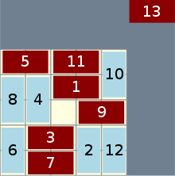

# AI & Games: Domineering 
<p align="center">
 
</p>


## How to Install

First of all for running the project you will need a recent python version (>3.8.x).

<br>
For a clean installation we recommend you to install the project in a python virtual environment. For this you can execute the following bash commands. 

```code
source activate.sh
activate
```
### Create a Dataset 
A dataset is already at your disposal, training examples are generated with Monte Carlo Tree Search Algorithm. If you want to regenerate one with different c value (hyperparameter of the algorithm) you can change the C_VALUE global variable in dataset.py,
and run:

```code
python3 dataset.py
```

### Running a training 
You can find weights in the weights folder: These are weights from a model trained with specific parameters but if you want to train with your own parameters you can launch a training like this:
<br>

```code
python3 train.py --arguments_to_specify
```
where arguments are:

| Argument | Default Value | Further Information |
|:---------:|:-----------:|:-----------:|
| `train` | False ||
| `res_blocks` | 3 | num of res layers per levels |
| `levels` | 1 | num of levels(stages) in the network resnet architecture. At stage i there are (2**i+5) filters in convolution layers of this level. |
| `epochs` | 50 | |
| `batch_size` | 50 ||
| `dropout` | 0 (No dropout) ||

So one example of a command for a training would be:

```code
python3 train.py --train 1 --res_blocks 3 --levels 2 --epochs 200 --batch_size 80 --dropout 0.1
```

### Visualisation Of Results
Training performance on the validation and training set are stored on a graph png image in the output folder.


### Running Simulations
Thousands of games played between various AI is done by:
```code
python3 simulation.py
```
### Issues & Troubleshooting

For running the project correctly it is important that you are able to install all the required library with each specific versions.


